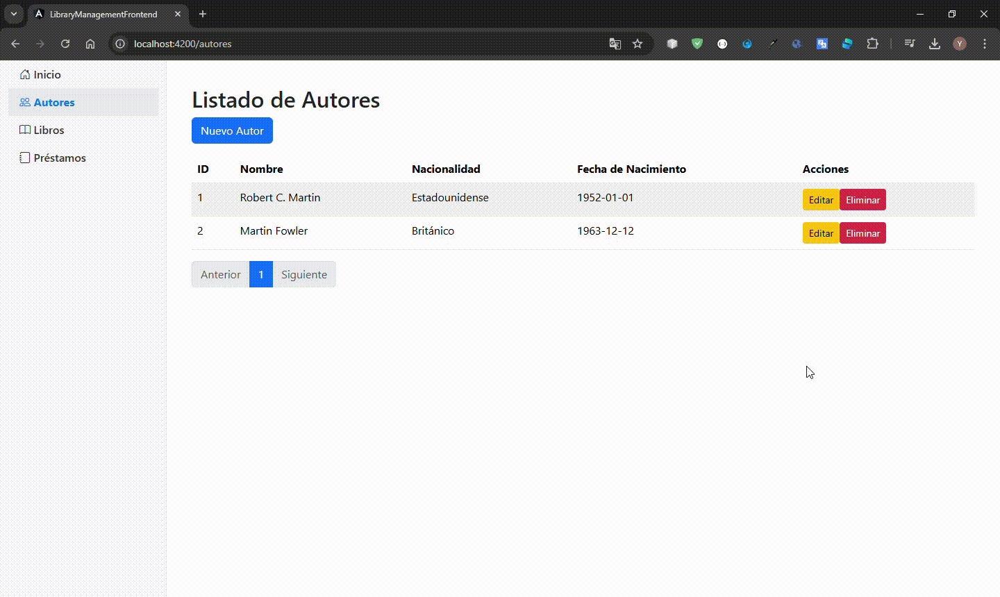
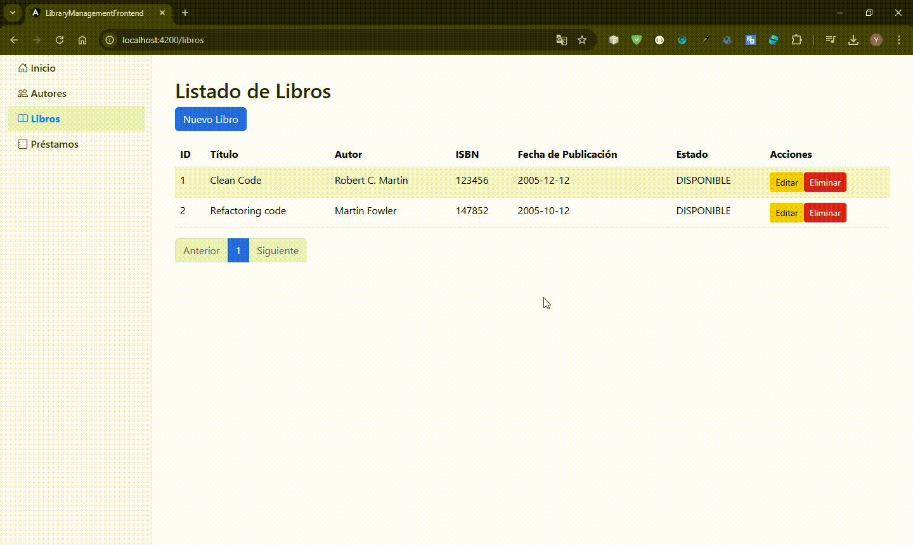
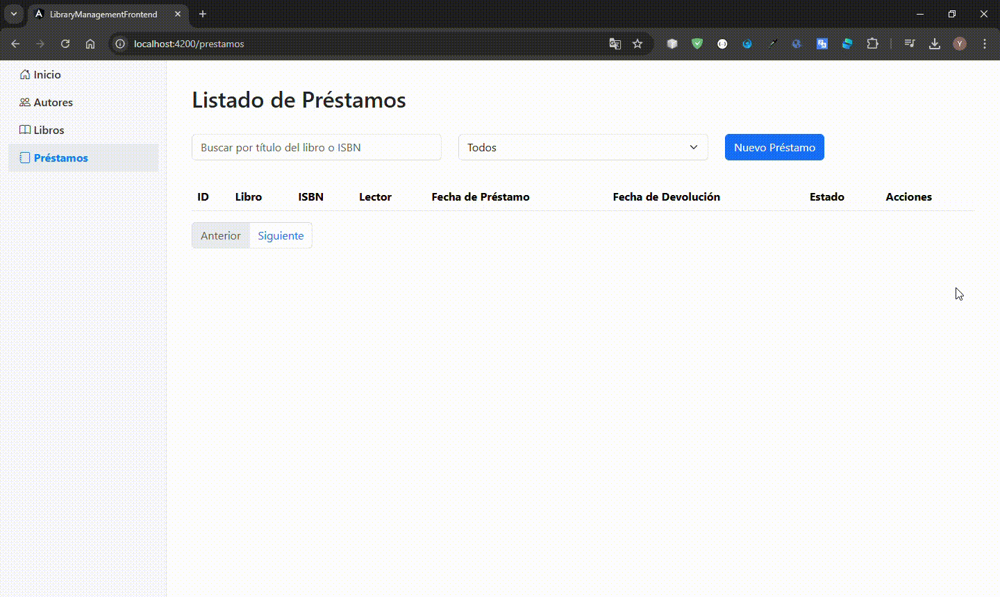

# 📚 Gestión de Biblioteca - Frontend

## Descripción del Proyecto

El proyecto **Gestión de Biblioteca** es una aplicación web diseñada para gestionar libros, autores y préstamos en una biblioteca. Incluye funcionalidades como agregar, editar, eliminar y listar libros, autores y préstamos, con un enfoque en validaciones reactivas.

---

## 🛠️ Tecnologías Utilizadas

- **Framework:** Angular 16
- **Estilos:** Bootstrap 5
- **Librerías Adicionales:** Angular Reactive Forms
- **Editor Recomendado:** Visual Studio Code

---

## ✨ Características Principales

1. **Gestión de Libros:**
   - Página con formulario para agregar, editar y eliminar libros.
   - Listado de libros con soporte para paginación.
   - Validaciones reactivas para los formularios.

2. **Gestión de Préstamos:**
   - Página para listar todos los préstamos y registrar nuevos.
   - Filtros dinámicos por título del libro, ISBN y estado (Activo/Finalizado).
   - Validaciones reactivas para los formularios.

3. **Gestión de Autores:**
   - Página para agregar, editar y eliminar autores.
   - Listado con soporte para paginación.
   - Validaciones reactivas para los formularios.

4. **Dashboard:**
   - Vista inicial que muestra el total de libros, autores y préstamos.

---

## 🚀 Pasos para levantar el Frontend

#### **Requisitos Previos**
- **Node.js y NPM** instalado.
- **Angular CLI** instalado.

#### **Instrucciones**

1. Clona el repositorio:
   ```bash
   git clone https://github.com/YoelPatricio/library-management-frontend.git
   cd library-management-frontend

2. Instala las dependencias:
   ```bash
   npm install

3. Configurar url del backend en:
   ```bash
   src/environment/enviroment.ts

4. Ejecuta el proyecto en modo desarrollo:
   ```bash
   ng serve

5. Accede a la aplicación en el navegador:

   - **URL:** [http://localhost:4200](http://localhost:4200)


## 📁 Estructura del Proyecto


## 📸 Capturas de Pantalla

### **Dashboard**


### **Gestión de Autores**


### **Gestión de Libros**


### **Gestión de Prestamo**
